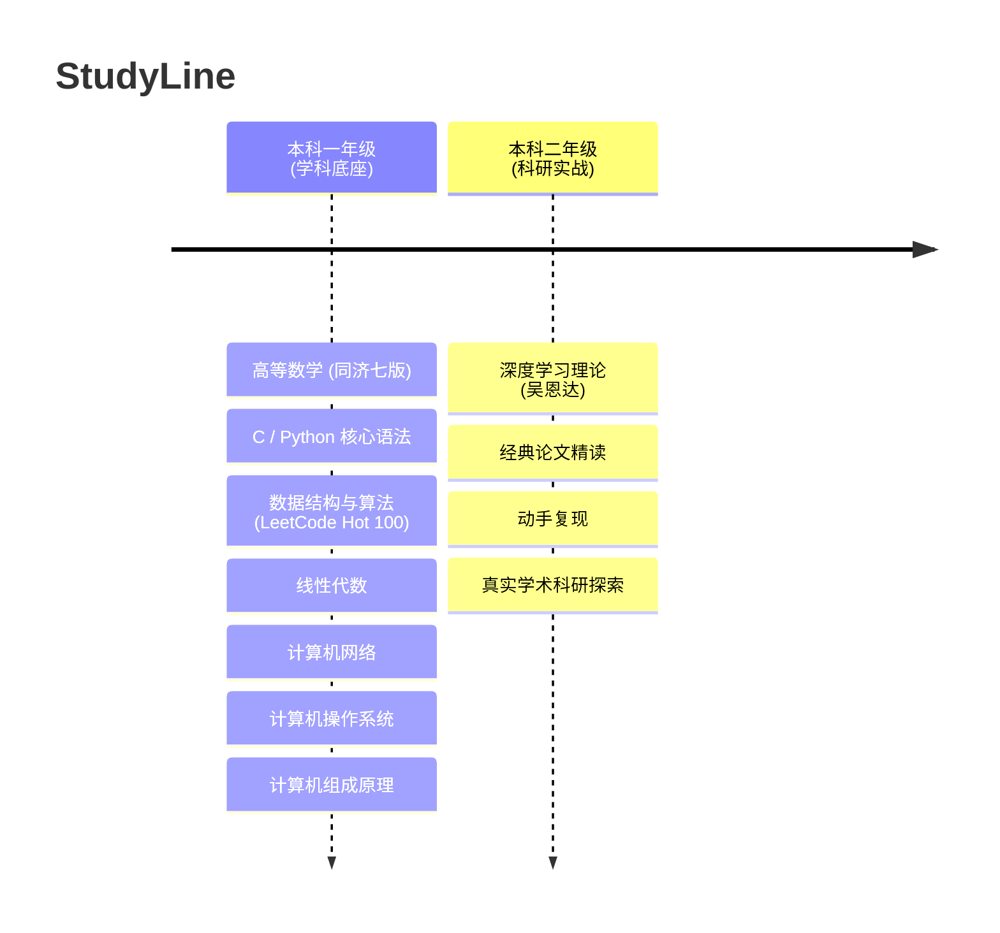

# StudyLine

> **“基础不牢，地动山摇；研之有物，行以致远。”**  

  
  

[本科一年级](./本科一年级.md) · [本科二年级](./本科二年级.md)

---

## 整体路线概览 (Roadmap)

---

## 资料索引 (Citefile)

本项目仓库的 `citefile/` 目录下收录了全套高清带书签/可检索版本的权威电子书与配套答案，即开即学：

<b>点击展开完整参考书单清单</b>

- **高等数学**
  - 《高等数学教材上册【第七版】》 & 配套《全解指南》
  - 《高等数学教材下册【第七版】》 & 配套《全解指南》
- **线性代数**
  - 《线性代数 同济第六版》 & 配套《辅导与习题全解》
- **计算机 408 核心**
  - 《数据结构（C语言版 第3版）双色版 (李冬梅)》
  - 《计算机网络（第8版）_谢希仁 (上/下)》
  - 《计算机操作系统（第4版）汤小丹、汤子瀛》
  - 《计算机组成原理》唐朔飞
- **概率与深度学习**
  - 《概率论与数理统计教程（第2版）茆诗松》 & 习题解答
- **深度学习**
  - 《Deeplearning 深度学习笔记 v5.72》

---

## 学习理念与要求

1. **坚持每日背单词**：英语阅读是通往国际前沿学术论文（ArXiv、NeurIPS、ICLR、CVPR）的必备桥梁，从大一开始保持英语敏感度。
2. **拒绝只看不练**：所有的数学公式，必须动手草稿推导；所有的代码算法，必须上机调试跑通。
3. **善用工具与社区**：遇到难点积极查阅 GitHub、ArXiv、Bilibili 公开课，并善用 AI 工具协助理解难懂的数学概念或代码报错。

---

