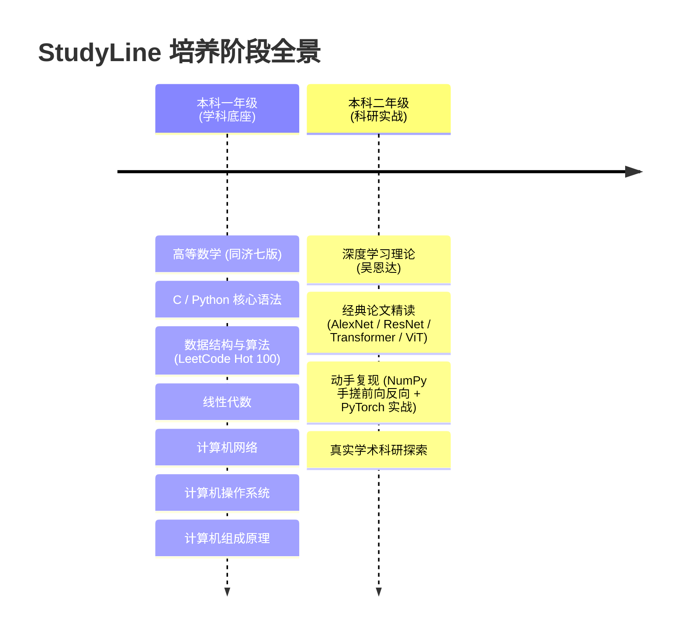

<div align="center">

# 🎓 StudyLine · 计算机学术与工程成长路线图

> **“基础不牢，地动山摇；研之有物，行以致远。”**  
> 一套系统、硬核、可量化的计算机本科生进阶与科研培养路线。

<p align="center">
  
  
  
  
  
</p>

[📚 一年级：夯实地基](#-本科一年级夯实学科底座) • [🔬 二年级：科研进阶](#-本科二年级科研论文与深度学习) • [📦 附带资料库](#-资料索引-citefile) • [💡 学习倡议](#-学习理念与要求)

---

</div>

## 🧭 整体路线概览 (Roadmap)



---

## 📘 [本科一年级：夯实学科底座](./本科一年级.md)

> **培养目标**：全面覆盖考研/顶级外企求职必备的 **数学基础**（数一标准）与 **408 计算机核心四大件**，辅以扎实的 **编码及算法能力**。

| 时间周期 | 核心模块 | 学习重点 & 经典教材 | 产出与检验标准 |
| :--- | :--- | :--- | :--- |
| **11月** | **高等数学（上册）** | 函数极限、微积分中值定理、定积分/不定积分、微分方程 | 同济课后习题、积分表公式手工证明、考研精选题 |
| **12月** | **高等数学（下册）** | 向量代数、多元函数微分、重积分、曲线曲面积分、无穷级数 | 同济高数全套试卷、真题选编闭卷测试 |
| **01月** | **编程基石 (C / Python)** | C 语言底层指针与内存管理 / Python 高级语法、多线程与面向对象 | 菜鸟教程 100 题精练、排序算法手写、工程项目骨架 |
| **02月** | **数据结构 (C 语言版)** | 线性表、栈和队列、树与二叉树、图论、查找与经典排序 | 《数据结构》李冬梅版、核心数据结构手动编码 |
| **03月** | **算法攻坚 (LeetCode)** | **100 道高频经典算法题**<br>• 哈希 / 双指针 / 滑动窗口 / 子串<br>• 链表 / 二叉树 / 数组 / 矩阵<br>• 堆 / 图论 / 回溯 / 二分查找<br>• 动态规划 (一维与多维) / 贪心 / 位运算 | 达成 LeetCode 100 题 AC，建立题目难度与算法模板库 |
| **04月** | **线性代数** | 行列式、矩阵运算、向量组线性相关性、特征值与二次型 | 课后习题证明、**NumPy 矩阵代数运算底层实操** |
| **06月** | **计算机网络** | 体系结构、物理层、数据链路层、网络层、运输层、应用层协议 | 《计网》谢希仁版、**Python Socket TCP 跨机通信实作** |
| **07月** | **操作系统** | 进程控制与死锁、虚拟存储器管理、文件系统与 I/O 调度 | 《操作系统》汤小丹第4版、系统调用剖析 |
| **08月** | **计算机组成原理** | 系统总线、存储器层次结构、中央处理器 (CPU) 与 控制单元 (CU) | 《计组》唐朔飞版、深入计算机硬件底层逻辑 |

---

## 🔬 [本科二年级：科研论文与深度学习](./本科二年级.md)

> **培养目标**：彻底告别调包侠思维，实现**“经典理论深度理解 + 顶级顶会论文精读 + 纯手工 NumPy / PyTorch 源码复现”**三位一体。

### 🌟 核心技术成长树

```
二年级科研主线
├── 深度学习理论体系 (吴恩达 DeepLearning.ai / 李沐 / 李宏毅)
│   ├── DNN / 优化算法 (Adam, RMSProp) / 正则化 (Dropout, BatchNorm)
│   ├── CNN 卷积神经网络架构
│   └── RNN / LSTM / GRU 序列建模
├── 顶会经曲论文精读 (Paper Reading)
│   ├── 如何高效读论文 (李沐精读方法论)
│   ├── CV 视觉经典：AlexNet ➔ ResNet ➔ Vision Transformer (ViT)
│   └── NLP 语义巨浪：Attention Is All You Need (Transformer) ➔ BERT
└── 硬核工程实操 (Coding & Hands-on)
    ├── PyTorch 经典架构搭建与 MNIST / CIFAR 手写预测
    └── 进阶手搓：纯 NumPy 实现深度网络前向传播与反向传播（梯度推导）
```

---

## 📦 资料索引 (Citefile)

本项目仓库的 `citefile/` 目录下收录了全套高清带书签/可检索版本的权威电子书与配套答案，即开即学：

<details>
<summary><b>📂 点击展开完整参考书单清单</b></summary>

- **高等数学**
  - 《高等数学教材上册【第七版】》 & 配套《全解指南》
  - 《高等数学教材下册【第七版】》 & 配套《全解指南》
- **线性代数**
  - 《线性代数 同济第六版》 & 配套《辅导与习题全解》
- **计算机 408 核心**
  - 《数据结构（C语言版 第3版）双色版 (李冬梅)》
  - 《计算机网络（第8版）_谢希仁 (上/下)》
  - 《计算机操作系统（第4版）汤小丹、汤子瀛》
  - 《计算机组成原理》唐朔飞
- **概率与深度学习**
  - 《概率论与数理统计教程（第2版）茆诗松》 & 习题解答
  - 《Deeplearning 深度学习笔记 v5.72》

</details>

---

## 💡 学习理念与要求

1. **坚持每日背单词**：英语阅读是通往国际前沿学术论文（ArXiv、NeurIPS、ICLR、CVPR）的必备桥梁，从大一开始保持英语敏感度。
2. **拒绝只看不练**：所有的数学公式，必须动手草稿推导；所有的代码算法，必须上机调试跑通。
3. **善用工具与社区**：遇到难点积极查阅 GitHub、ArXiv、Bilibili 公开课，并善用 AI 工具协助理解难懂的数学概念或代码报错。

---

<div align="center">
  <sub>Study hard, stay humble, and make something awesome.</sub><br>
  <sub>Made with ❤️ for Computer Science students</sub>
</div>
